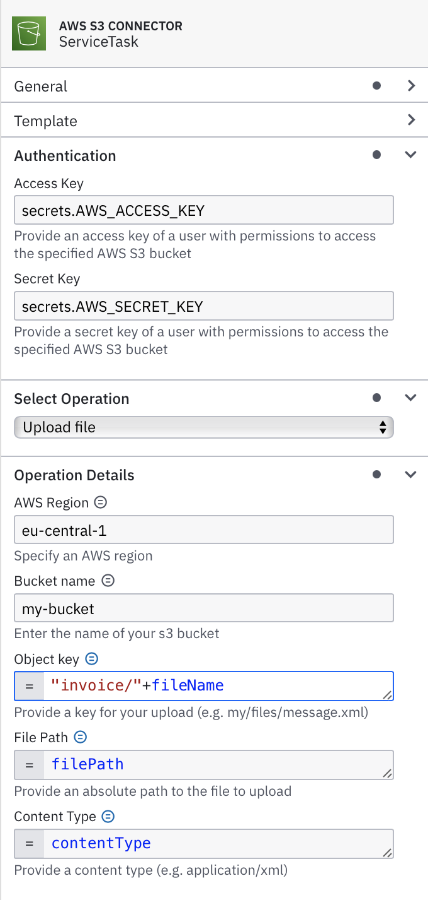

[](https://github.com/itsmestefanjay/camunda-s3-connector/actions/workflows/maven.yml)

# AWS S3 Connector

Camunda Outbound Connector to interact with the content of an S3 bucket

DISCLAIMER: You are responsible for your AWS configuration in your environment, keep in mind that you have to make
sure that you keep credentials in a safe place and only give access to specific resources, and be as restrictive as 
possible. This is not a security tutorial for AWS. You should definitively know what you are doing!

## Features

- Upload a generated file to an AWS S3 bucket
- Delete a file from an AWS S3 bucket


## Setup

### Connector configuration

| name            | description                                | example                     |
|-----------------|--------------------------------------------|-----------------------------|
| `accessKey`     | the AWS access key for the authorized user | `secrets.AWS_ACCESS_KEY`    |
| `secretKey`     | the AWS secret key for the authorized user | `secrets.AWS_SECRET_KEY`    |
| `region`        | the AWS region of your S3 bucket           | eu-central-1                |
| `bucketName`    | the name of the S3 bucket                  | camunda-s3-connector-bucket |
| `objectKey`     | path + file name in the s3 bucket          | `="invoice/"+fileName`      |
| `operationType` | what to do on s3                           | `PUT_OBJECT`                |
| `filePath`      | absolute path to the file to upload        | `=filePath`                 |
| `contentType`   | the content type of the content            | `=contentType`              |

NOTE: please do not put secrets directly into your configuration. See the secrets section for more details.

#### How it looks in the modeller


### AWS Resources
- S3 bucket (non-public) with server-side encryption and versioning enabled
- IAM User with putObject and deleteObject rights to the bucket
- Access key and Secret key for the IAM user

#### IAM policy

```json
{
    "Version": "2012-10-17",
    "Statement": [
        {
            "Sid": "AllowPutAndDeleteInS3",
            "Effect": "Allow",
            "Action": [
                "s3:PutObject",
                "s3:DeleteObject"
            ],
            "Resource": "arn:aws:s3:::<bucket-name>/*"
        }
    ]
}
```

## Runtime

### Get credentials from AWS

In order to access AWS from your connector you need the above mentioned user with a IAM policy for S3. Additionally
you need to generated credentials for the user. You can do this over the AWS console in IAM:

- Log into your AWS console
- Go to IAM > Users
- Select your created user, e.g. `camunda-s3-connector-user`
- Go to Security credentials > Access keys
- Click `Create access key`
- Select `Third-party service`
- Check that you understand the risk of having a permanent access key
- add a tag if wished
- Click on create and save your credentials in a save place

ATTENTION: There are many ways to achieve this in IAM, I only describe the easiest, 
but possibly not the safest way to do it

### Docker Compose

You can use the `docker-compose.yaml` file to start a local connector runtime with the AWS S3 connector. You need to set 
your connection details from Camunda:

```yaml
zeebe.client.cloud.region: my-region
zeebe.client.cloud.clusterId: my-cluster-id
zeebe.client.cloud.clientId: my-client-id
zeebe.client.cloud.clientSecret: my-client-secret
```

And add your access and secret key from your AWS user to the `runtime/connector-secrets.txt` file:

```properties
AWS_ACCESS_KEY=my-access-key
AWS_SECRET_KEY=my-secret-key
```

### Handling secrets
Since your connector needs to run in a custom connector runtime, you cannot just add secrets in the cloud console since
they will not be auto-magically transported into your connector runtime. You can provide them by:

- adding them as environment variables (e.g. when you use the SpringBoot connector runtime)
- adding them as an env file to your docker container

NOTE: This behaviour will most likely be improved in the future

### How to generate content?
The upload is done by resolving a local path to a `File`. Since a process variable is currently limited in size to approx. 
2-4MB (there are some Zeebe chaos engineering tests) the file content should stay in the connector runtime. You can e.g. 
use a `JobWorker` to generate a file and store it in a `/tmp` folder. You can then get the path and set it into a `filePath` 
variable, which you then can reference with a FEEL expression in the `file path` configuration of the connector:

```java
// generate file
File file=pdfService.generate(orderData);

// set as variables to be picked up by connector
variableHandler.setVariable("fileName",String.format("invoice-%s.pdf",orderData.getInvoiceId));
variableHandler.setVariable("filePath",file.getAbsolutePath());
variableHandler.setVariable("contentType","application/pdf");
```

## Example process

