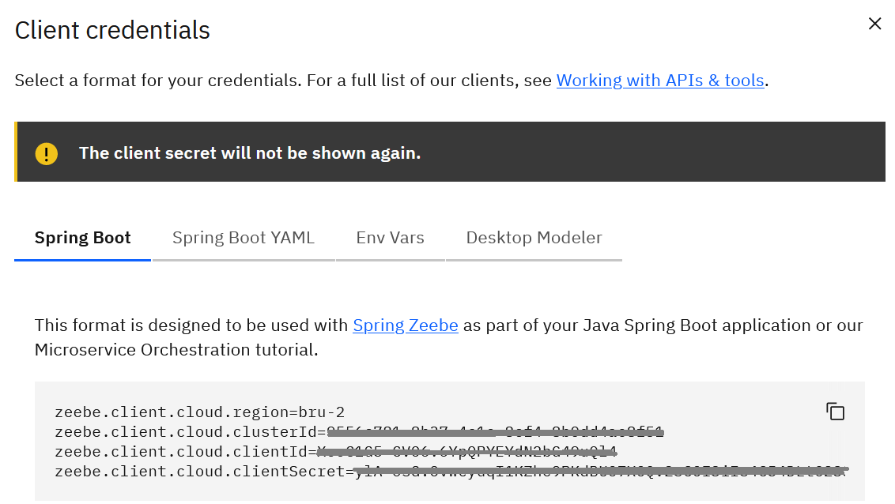

## AWS S3 Connector Example

### Use case

Your review process starts when a new file is uploaded to an S3 bucket. The file is downloaded, validated and the result 
published to S3 again

## Example process


## Setup

In this example the use of connectors and job workers is mixed together. The connector runtime is added as a dependency
while the job workers logic is located here. Both use the file api to access local and remote files.

## Running the example
- Configure your Springboot application for local or camunda platform

### Running on Camunda SaaS platform

#### 1. creating a cluster
First, you can sign up for a free trial of Camunda SaaS, which offers a 30-day duration. This trial allows you to 
explore the various features of the Camunda platform at no immediate cost.


navigate to the “Clusters” tab.
There you can create a new cluster by specifying a region and a name. To complete the creation process click on the blue create button on the right . In the cluster overview, you can also choose a cluster tag like “dev”, “test”, “stage” or “prod”, depending on the purposes for which it is to be used
Once you created a Cluster, you can see its properties like “Cluster Id” and “Region” down below

#### 2. creating a new client

For API Orchestration you must create an API to do this, go to the “API” tab and click on “Create”.
Now important properties such as Region, Cluster ID, Client ID and Client Secret are shown, save this information.
You will use this information later in the Spring Boot application by adding it to the application.properties file



#### 3. configuring application.properties in Spring Boot
these client properties are now copied to the application file in the Spring Boot application so that it
can connect to the client and cluster just created

```yaml
camunda.client.mode=saas
camunda.client.auth.client-id=myClientId
camunda.client.auth.client-secret=mySecrect
camunda.client.cluster-id=myClusterId
camunda.client.region=myRegion
```

- Add your access and secret key from your AWS as environment variables:

```
AWS_ACCESS_KEY:my-access-key
AWS_SECRET_KEY:my-secret-key
```

now your setup is ready to start and you can go over to "Starting the process"

### For local runtime:

```yaml
camunda.client.mode=simple
```
If you want to configure it besides the 'simple' defaults check out the [documentation](https://github.com/camunda-community-hub/spring-zeebe?tab=readme-ov-file#simple) of camunda!

NOTE: you don't need an Operate client for an outbound connector therefore I removed the AutoConfiguration for inbound 
connectors and the endpoint to Operate from the properties


- Start the Springboot application
- Or build a Docker image with the provided [Dockerfile](../docker/Dockerfile) and use it in a docker-compose environment
  with the provided [docker-compose file](../docker/docker-compose.yaml)
  - You need to change the executed jar file in the Dockerfile from `*-standalone` to `*-example` to do so

NOTE: the docker image is based on the `arm64v8` architecture since it is developed on an Mx chip by Apple, you can switch this out
for any matching architecture:

```
FROM arm64v8/openjdk:21
```

### Starting the process

You can load the example.bpmn file into the Camunda SaaS platform Modeler and 
start a process instance with the following variable

```json
{
  "report": {
    "region": "eu-central-1",
    "bucket": "my-connector-bucket",
    "key":"reports/report-xyz.txt"
  }
}
```

- “region” stands for the region in which the S3 bucket is located.
- “bucket” describes the name of your S3 bucket.
- “key” is a unique identifier for a file or an object within an S3 bucket.


NOTE: the bucket and the report file must exist on your AWS Account. The AWS setup is described in 
the [connector's README](../connector-aws-s3-libs/README.md)

You can also use e.g. postman and run a grpc call `Gateway/CreateProcessInstance` against the cluster

```json
{
  "bpmnProcessId": "<key of process definition>",
  "processDefinitionKey": "<process instance key>",
  "variables": "{ \"report\": { \"region\": \"eu-central-1\", \"bucket\": \"my-connector-bucket\", \"key\":\"reports/my-report-123.txt\" } }",
  "version": 2
}
```


Now if you started the process, you could monitor the process via Camunda Operate to get detailed insights into the 
execution and all of the components of your process instances.

For performance and observability, you can use the Camunda Optimize as well, there you can see how many process 
instances are running, or where possible errors occur in the process

## Integration testing the process with AWS

To do an integration test I use the following technologies:

- Testcontainer [localstack module](https://java.testcontainers.org/modules/localstack/) to mimik AWS S3
- SpringBootTest to run my process application
- SpringZeebeTest to run an in-memory Zeebe process engine and assert the state of the process

## Further improvement ideas

- Use an inbound connector to get notified via SQS or SNS if there are new files instead of setting it explicitly via
variables
