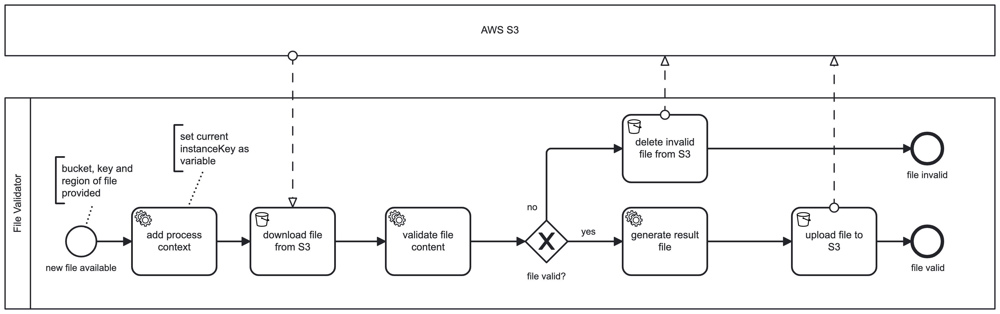

## AWS S3 Connector Example

### Use case

Your review process starts when a new file is uploaded to an S3 bucket. The file is downloaded, validated and the result 
published to S3 again

## Example process


## Setup

In this example the use of connectors and job workers is mixed together. The connector runtime is added as a dependency
while the job workers logic is located here. Both use the file api to access local and remote files.

### How to run it
- Configure the application to connect to a local or remote Camunda platform instance
- Set your secret values as environment variables (AWS_ACCESS_KEY and AWS_SECRET_KEY)
- Start the Springboot application
- Start a process instance with the following variable

```json
{
  "report": {
    "region": "eu-central-1",
    "bucket": "my-connector-bucket",
    "key":"reports/report-xyz.txt"
  }
}
```

NOTE: the bucket and the report file must exist on your AWS Account. The AWS setup is described in 
the [connector's README](../connector-aws-s3/README.md)

## Further improvement ideas

- Use an inbound connector to get notified via SQS or SNS if there are new files instead of setting it explicitly via
variables